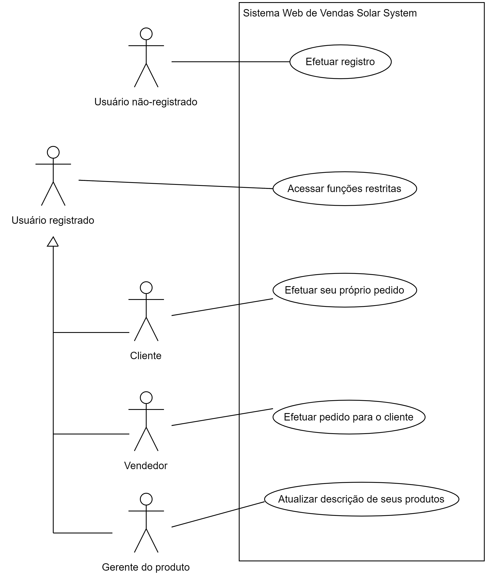

**Índice**

- [1. Introdução](#1-introdução)
- [2. Informações sobre a empresa](#2-informações-sobre-a-empresa)
- [3. Escopo do projeto](#3-escopo-do-projeto)
- [4. Interessados](#4-interessados)
- [5. Objetivos funcionais](#5-objetivos-funcionais)
- [6. Objetivos não-funcionais](#6-objetivos-não-funcionais)
- [7. COTS (Commercial Off-The-Shelf)](#7-cots-commercial-off-the-shelf)
- [8. Casos de uso](#8-casos-de-uso)
  - [8.1. Acessar funções restritas](#81-acessar-funções-restritas)
  - [8.2. Efetuar registro](#82-efetuar-registro)
  - [8.3. Efetuar seu próprio pedido](#83-efetuar-seu-próprio-pedido)
  - [8.4. Efetuar pedido para o cliente](#84-efetuar-pedido-para-o-cliente)
- [9. Wireframes](#9-wireframes)
- [10. Diagrama de classes de domínio](#10-diagrama-de-classes-de-domínio)

> Observação do professor: Este documento é um exemplo de parte de uma especificação de software. Não está com todos os detalhes necessários para iniciar o desenvolvimento de um software, mas serve de template para que cada grupo inicie a redação do documento do seu projeto.

> É uma adaptação, mas não uma tradução exata, de um [exemplo disponível na Universidade de Ohio](http://web.cse.ohio-state.edu/~bair.41/616/Project/Example_Document/Req_Doc_Example.html).

# 1. Introdução

Este é um documento de especificação de requisitos para um novo sistema web de vendas de produtos da Empresa Solar Systems. A Empresa Solar Systems vende equipamentos para a geração de energia elétrica de formas alternativas, tais como células fotovoltaicas e turbinas eólicas.

O sistema deverá permitir que clientes e funcionários da empresa naveguem pelo catálogo de produtos e efetuem pedidos de produtos de forma on-line.

Este documento descreve os requisitos não-funcionais, modela os requisitos funcionais com casos de uso e modela os conceitos do domínio do problema.

# 2. Informações sobre a empresa

A Empresa Solar Systems vende equipamentos para a geração de energia de formas alternativas e identificou tendências que causarão um aumento significativo na demanda por seus produtos.

Devido à natureza técnica e inovadora de seus produtos, a empresa possui vendedores capazes de orientar os clientes no processo de escolher um sistema de energia alternativa. A empresa possui também funcionários que têm a função de gerente do produto. O gerente do produto é um especialista em um determinado produto ou em uma determinada linha de produtos. Ele produz os *whitepapers*, documentos altamente técnicos e focados nas especificações dos produtos.

# 3. Escopo do projeto

O escopo deste projeto é um sistema web que dá suporte à venda de produtos da empresa diretamente aos clientes, bem como à rede de vendedores. A publicidade de produtos, o controle de estoque e a cobrança não são parte deste projeto.

A engine de pesquisa web será adquirida como um componente pronto para o novo sistema. Os detalhes internos desta engine não fazem parte deste projeto. Questões de segurança do site, além da proteção por senha no próprio site, também não são parte do projeto.

> Observação do professor: neste exemplo, deixei como parte do projeto somente a proteção por senha, assumindo que as demais questões de segurança serão tratadas pela equipe de operações. No caso do projeto do seu grupo, será necessário tratar destes outros aspectos de segurança.

# 4. Interessados

Aqueles que irão se beneficiar diretamente e aqueles que serão afetados pelo novo sistema:

* Clientes: Conseguirão navegar pelo site para encontrar e fazer pedidos de produtos. Poderão escolher entre pedir diretamente da empresa ou através de um vendedor.

* Vendedores: Conseguirão navegar pelo site e obter informações atualizadas, precisas e detalhadas dos produtos. Serão informados de clientes em potencial e conseguirão se comunicar com o gerente do produto.

* Gerentes do produto: Conseguirão atualizar diretamente as informações de seus produtos.

* Serviço de Atendimento ao Consumidor (SAC): O sistema reduzirá a carga de trabalho no SAC, pois os clientes conseguirão encontrar de forma mais fácil as informações que necessitam.

* Departamento de Marketing:: Os dados de navegação no site poderiam ser enviados para o departamento de marketing. Entendendo como um cliente usa o site ao fazer um pedido, o departamento poderá propor e implementar melhorias para manter os clientes.

* Departamento de Contabilidade: As informações dos pedidos serão enviadas diretamente para a contabilidade, permitindo uma cobrança mais ágil e eficiente.

* Departamento de Logística: As informações dos pedidos serão enviadas diretamente para o departamento de logística, que dará baixa no estoque e providenciará o envio do produto.

* Departamento de Tecnologia da Informação: Será responsável pela implementação da nova base de dados, hospedagem da aplicação web e manutenção do sistema.

# 5. Objetivos funcionais

1. O sistema deverá permitir que clientes e vendedores efetuem pedidos de produtos on-line.  
   
   Para os clientes, isto eliminará a demora atual entre a sua decisão de comprar e a realização do pedido.

   Isto também reduzirá o tempo que o vendedor gasta para elaborar um pedido.

2. O sistema deverá permitir que os gerentes de produto atualizem a descrição de seus produtos no site.  
   
   Isto reduzirá a quantidade de acessos a informações desatualizadas.

   Isto eliminará a atualização da informação em diversos documentos.

3. O sistema deverá permitir que os funcionários vejam quem é o gerente de produto para qualquer produto da empresa, bem como as informações para entrar em contato (ramal, celular, email).

   Isto reduzirá o tempo para um funcionário encontrar e entrar em contato com o gerente de um determinado produto.

4. O sistema deverá permitir que o cliente entre em contato diretamente com o escritório de vendas mais próximo da sua região.

   Isto reduzirá o tempo para o cliente enviar uma requisição e receber uma resposta.

5. O sistema deverá permitir contabilizar dados precisos das transações de compra.

   Isto melhorará o atendimento ao cliente reduzindo problemas relacionados à cobrança.

6. O sistema deverá permitir enviar os produtos com dados precisos da compra.

   Isto permitirá maior agilidade no processamento dos pedidos e na atualização do estoque.

7. O sistema deverá permitir que sejam realizadas pesquisas em todo o texto das páginas web a que o usuário tem acesso. O sistema deverá permitir as seguintes pesquisas:
   * pesquisar todas as palavras
   * pesquisar qualquer uma das palavras
   * pesquisar a frase exata

8. O sistema deverá permitir que os *whitepapers* sejam acessados nas páginas dos próprios produtos.

   Isto permitirá que os clientes encontrem sozinhos as informações, reduzindo o custo de suporte ao cliente.

9.  O sistema deverá permitir que o status do usuário seja armazenado para a próxima vez que ele retornar à aplicação web.
    
    Isto reduzirá o tempo de visita do usuário, pois ele não precisará fornecer novamente dados que ele já entrou em uma visita anterior.

10. O sistema deverá fornecer ao departamento de marketing as informações de navegação do cliente.

   Esta informação permitirá que o marketing determine qual informação disparou a compra e ajudará a abordar clientes em potencial de forma mais efetiva.

11. O sistema deverá traduzir as páginas web nos idiomas dos países onde os produtos da empresa estão disponíveis.

   Isto melhorará o serviço ao cliente e reduzirá o número de chamadas ao suporte por clientes estrangeiros.

# 6. Objetivos não-funcionais

a. O sistema deverá estar completamente operacional pelo menos 99.99% do tempo.

b. O tempo fora do ar após uma falha não deverá exceder 0.5 hora.

c. O vendedor deverá ser capaz de utilizar o sistema em seu trabalho após um treinamento de 2 dias.

d. Um usuário que já sabe qual produto lhe interessa deve ser capaz de localizar e ver a página do produto em 20 segundos.

e. O número de páginas web pelas quais o usuário precisa navegar para acessar a informação do produto a partir da página principal não deve ser maior do que 2.

f. O sistema deverá ser capaz de suportar 1000 usuários simultâneos.

g. O tempo médio para visualizar uma página web em uma conexão de 1Mbps não deverá exceder 5 segundos.

h. O tempo médio para baixar e visualizar um *whitepaper* em uma conexão de 1Mbps não deverá exceder 10 segundos.

i. O sistema deverá oferecer acesso protegido por senha para páginas web que são acessadas somente por funcionários.

j. Os dados de transação devem ser transmitidos de forma criptografada.

k. O sistema deverá ser capaz de acomodar novos produtos e novas linhas de produto sem necessidade de alterações na sua implementação.

l. O site web do sistema deverá ser visível nos navegadores Mozilla Firefox (versão $\ge$ 75.0.0), Google Chrome (versão $\ge$ 81.0.0) e Microsoft Edge (versão $\ge$ 5.0.0).

m. O sistema deverá disponibilizar uma página web que explica como navegar pelo site. A página deverá ser customizada com base nas páginas que o usuário pode acessar. Esta página de ajuda deverá ser acessível a partir de todas as outras páginas.

o. O sistema deverá ter interface com

* Uma base de dados relacional para informações dos produtos e dos pedidos.
* O sistema atual de contabilidade da empresa.
* O sistema atual do departamento de logística.
* O tradutor (a ser adquirido).
* A engine de pesquisa (a ser adquirida).

# 7. COTS (Commercial Off-The-Shelf)

Os softwares que serão adquiridos para compor o sistema são:

* Tradutor do português para o inglês e do português para o espanhol.

* Engine de pesquisa.

# 8. Casos de uso

A figura a seguir apresenta o diagrama de casos de uso:

## 8.1. Acessar funções restritas

**Nome do caso de uso:** Acessar funções restritas

**Resumo:** Para ganhar acesso a informações restritas ou personalizadas, fazer pedidos ou outras transações especializadas, um usuário precisa se autenticar e o sistema determinará seu nível de acesso.

**Pré-condições:**
* O usuário já se registrou.

**Pós-condições:**
* O usuário pode obter informações e realizar funções disponíveis para o seu nível de acesso.

**Fluxo principal:** 

1. O usuário seleciona a operação para efetuar o login.
2. O sistema solicita o seu *username* e a sua senha.
3. O usuário entra seu *username*  e sua senha.
4. O sistema verifica que o *username* e a senha correspondem às informações de um de seus usuários registrados.
5. O sistema inicia uma sessão e apresenta uma mensagem de boas-vindas baseada nas preferências do usuário.

**Fluxos alternativos:**

Passo 4:
* Se o *username* é invalido, o caso de uso retorna para o passo 2.

Passo 4:
* Se o *username* é válido e a senha é inválida, o sistema dá uma nova oportunidade para o usuário entrar a senha. Quando o usuário entra outra senha, o caso de uso continua com o passo 4, utilizando o *username* já informado e a nova senha.

## 8.2. Efetuar registro

> (em elaboração)

## 8.3. Efetuar seu próprio pedido

> (em elaboração)

## 8.4. Efetuar pedido para o cliente

> (em elaboração)

# 9. Wireframes

> (em elaboração)

# 10. Diagrama de classes de domínio

> (em elaboração)